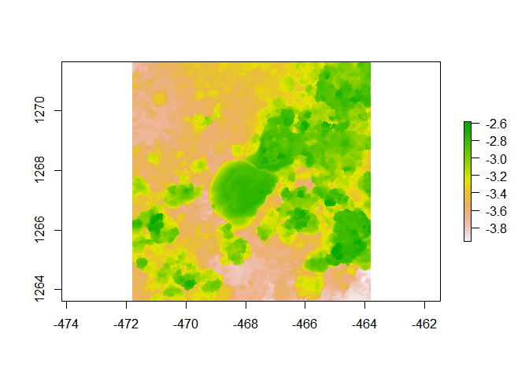

Assignment
================
Ji Hoon Justin Han
2023-08-22

``` r
library(fishualize)
library(ggplot2)
library(fishualize)
library(dplyr)
```

    ## 
    ## Attaching package: 'dplyr'

    ## The following objects are masked from 'package:stats':
    ## 
    ##     filter, lag

    ## The following objects are masked from 'package:base':
    ## 
    ##     intersect, setdiff, setequal, union

``` r
library(raster)
```

    ## Loading required package: sp

    ## The legacy packages maptools, rgdal, and rgeos, underpinning the sp package,
    ## which was just loaded, will retire in October 2023.
    ## Please refer to R-spatial evolution reports for details, especially
    ## https://r-spatial.org/r/2023/05/15/evolution4.html.
    ## It may be desirable to make the sf package available;
    ## package maintainers should consider adding sf to Suggests:.
    ## The sp package is now running under evolution status 2
    ##      (status 2 uses the sf package in place of rgdal)

    ## 
    ## Attaching package: 'raster'

    ## The following object is masked from 'package:dplyr':
    ## 
    ##     select

``` r
library(habtools)
```

    ## 
    ## Attaching package: 'habtools'

    ## The following object is masked from 'package:raster':
    ## 
    ##     extent

``` r
plot(horseshoe)
```

    ## Warning in sp::CRS(...): sf required for evolution_status==2L

    ## Warning in sp::CRS(...): sf required for evolution_status==2L

<!-- -->

# About me

I am a 5th year PhD student working at Coral Reef Ecology Lab and Hunter
Lab. My research focuses on nutrient impacts on coral and coral
bleaching. I am taking this course because my research has been mainly
focused on colony level physiological changes from stressors, so I
believe this is a good opportunity to experience different approaches to
studying corals and coral reefs. I want to get out of this class to
expand my knowledge about the structural perspective of coral reefs and
their role in physiological/ecological changes in corals. I am
definitely not super familiar with R program, but I understand the
basics of R programs and how coding works. Fun Fact about me is that I
am allergic to coral.
